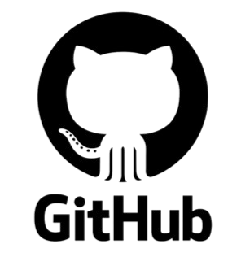

# 🐙 P01: GitHub. Treballant de forma col·laborativa: forks i pull request

## 📝 Breu descripció

Molt bona feina, equip.  
Ara que dominem les eines de manera individual (servidors, permisos, etc.), és hora d'aprendre a treballar **com un equip coordinat**, tal com fem a EverPia.

A la nostra consultora, és impensable que tothom treballi en una sola branca "main" o que s'enviïn arxius per correu. Treballem amb un **flux de treball de Git/GitHub professional**, amb jerarquies (Caps d'Equip, Júniors) i revisió de codi via **Pull Requests**.

En aquesta activitat simularem el nostre procés d’**Onboarding** de nous consultors i configurarem el repositori central de l’empresa.  
L’objectiu és dominar el **flux col·laboratiu de Git**, incloent forks i pull requests, una habilitat clau al sector.

---

## 🔄 Flux de Treball de GitHub a EverPia

- Treball en grups habituals.  
- Cada grup designarà un **Team Leader (Líder d'Equip)**.  
- La resta seran els **Membres de l'Equip**.  

---

## 📂 Recurs Base

- **Repositori Base (EverPia-Core):**  
  [https://github.com/SMX2m/EverPia-Onboarding](https://github.com/SMX2m/EverPia-Onboarding)

---

## 📚 Materials i links de suport

- **Guia de l’activitat:**  
  [https://github.com/SMX2n/Projecte04-GuiaGitHub](https://github.com/SMX2n/Projecte04-GuiaGitHub)

