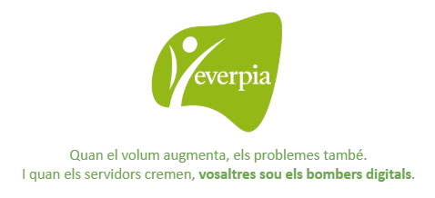

# 🚀 Projecte-04

# 📘 EverPia 3: *“Sobreviure en una empresa IT”*

Després de setmanes convivint amb el ritme imprevisible d’una consultora tecnològica, arriba al darrer capítol de la trilogia **EverPia**. És un moment que combina entusiasme, maduresa i una sensació molt real: aquesta etapa s’acaba, i comença alguna cosa nova. ✨

A les consultores, la trajectòria professional segueix un patró gairebé universal:  
**Qui entra com a júnior ho fa sense saber gaire què s’hi trobarà, però en surt transformat.** 🔄

---

## Problema i solució

- **Problema:** L'empresa no tenia pla de recuperació davant desastres, no es podia accedir remotament als servidors i no hi havia serveis de fitxers ni impressió centralitzats.
- **Solució:** Vam definir una política de backups i imatges del sistema, vam configurar SSH i RDP per a l'accés remot i vam desplegar servidors NFS i CUPS per centralitzar fitxers i impressió.

---

## 🔥 El dia a dia d’un júnior

De sobte et veus:
- apagant incendis 🔥,
- assumint tasques que no surten al contracte 📄,
- donant suport a companys amb més experiència 🤝,
- resolent problemes d’origen desconegut ❓,
- i aprenent a una velocitat que no apareix a cap manual ⚡.

Aquesta intensitat **et fa créixer**.  
Aquesta pressió **et defineix**.  
Aquesta experiència accelerada **et converteix en professional**. 💼

I un dia, sense adonar-te’n, descobreixes que ja no ets el mateix júnior que va entrar per la porta amb por i il·lusió. Ara tens:
- eines 🧰,
- criteri 🎯,
- documentació pròpia 📚,
- i una mirada analítica que només es guanya treballant molt i en silenci. 🤫

---

## 🚀 L’origen del projecte

Aquest projecte neix exactament d’aquí: d’aquell moment en què tu —com qualsevol treballador de consultoria— **comences a intuir que estàs preparat per fer el salt**.

📈 Per deixar de ser la baula més jove de la cadena.  
🛤️ Per començar a dissenyar el teu propi camí.

Ara ja ho sap: **està a punt de sortir d’EverPia.**  
I vol fer-ho **per la porta gran**. 🚪✨

---

## 🧭 La carta de presentació professional

Aquest projecte és la seva oportunitat per demostrar qui és després de tot el que ha viscut:
- què ha après 📘,
- com treballa 🛠️,
- com documenta 📝,
- com investiga 🔍,
- com proposa solucions 💡,
- i com afronta reptes complexos sense perdre el nord 🧭.

No és un conjunt de tasques.  
És **la seva carta de presentació professional**. 🖋️

---

## 🎓 El tram final de les pràctiques

Ja saps que et trobes a les últimes setmanes a EverPia. I precisament per això vols acabar **per la porta gran**: demostrant que domines allò que fa uns mesos semblava impossible, validant la capacitat de treball en equip i executant tasques que requereixen una mirada madura i professional.

Aquest projecte representa **la darrera etapa del període de pràctiques internes** dels alumnes dins l’empresa EverPia, on han estat treballant com a *junior IT* durant tot el trimestre. 🖥️👨‍💻

---

## 🧩 Què hauràs d’afrontar?

Durant quatre setmanes hauràs de donar resposta a encàrrecs reals dins l’ecosistema empresarial d’EverPia, com ara:

- Gestió d’emergències 🚨  
- Millora de processos ⚙️  
- Automatització de sistemes 🤖  
- Administració de repositoris 📦  
- Implementació de serveis d’accés remot 🌐  
- Desplegament de solucions de disseny i comerç electrònic 🛒🎨  

Aquest projecte vol posar-te en situació d’assumir, amb autonomia progressiva, **rols i responsabilitats reals** dins d’una empresa tecnològica de mida petita o mitjana. 🏢💡

Benvinguts a EverPia 2: “Sobreviure en una empresa IT”, una simulació (massa realista) del que passa quan una empresa tecnològica comença a créixer i a rebre més clients dels que pot gestionar.

## 🛠️ TASQUES A DESENVOLUPAR

Les tasques que caldrà desenvolupar en aquest projecte són les següents:

- **T01**   -->   [T01: DRP: còpies de seguretat. Estudi cas client (treball cooperatiu)](/Tasques/tasca01) 💾
- **T02**   -->   [T02: DPR: còpies de seguretat. Cas pràctic](/Tasques/tasca02) 💻
- **T03**   -->   [T03: Pla de recuperació davant desastres: imatges del sistema](/Tasques/tasca03) 🔄
- **T04**   -->   [T04: Accés remot](/Tasques/tasca04) 🌐 
- **T05**   -->   [T05: Accés Remot. Connexió via SSH (tasca individual)](/Tasques/tasca05) 🔒   
- **T06**   -->   [T06: Accés remot. Escriptori remot (RDP) (tasca individual)](/Tasques/tasca06) 🖥️
- **T07**   -->   [T07: Accés remot. Serveis d’assistència remota (tasca en parelles)](/Tasques/tasca07) 🤝
- **T08**   -->   [T08: Auditoria de Qualitat i Estandardització de Servidors (tasca individual)](/Tasques/tasca08) ✅
- **T09**   -->   [T09: Servidor fitxers Linux. NFS (tasca individual)](/Tasques/tasca09) 📂
- **T10**   -->   [T10: Servidor impressió Linux. CUPS (tasca individual)](/Tasques/tasca10) 🖨️
- **T11**   -->   [T11: Introducció a Figma: nocions bàsiques de disseny d’interfícies](/Tasques/tasca11) 🎨
- **T12**   -->   [T12: Fonaments del Disseny Web Comercial: Landing Page + Procés de Checkout](/Tasques/tasca12) 🌐
- **T13**   -->   [T13: Disseny d’un E-commerce en Figma (Landing Page + Checkout)](/Tasques/tasca13) 🛒
- **T14**   -->   [T14: Sostenibilitat. Prova Escrita - 1h](/Tasques/tasca14) 🌱
- **T15**   -->   [T15: Com de circular és la meva família professional?](/Tasques/tasca15) 🔄👨‍👩‍👧‍👦

## 📦 Productes finals a avaluar

Els productes finals que s’avaluaran són els següents:

- **P01**   -->   [P01: GitHub. Treballant de forma col·laborativa: forks i pull request.](/Productes/p01) 🧑‍💻
- **P02**   -->   [P02: Presentació i Projecció de la Maqueta al Client](/Productes/p02) 📊
- **P03**   -->   [P03: Kanban del projecte](/Productes/p03) 📋

