# Còpies de seguretat a Linux

## Afegir disc a la màquina

Afegim un disc de 10 GB per poder fer la còpia de seguretat.


Al entrar a la màquina ubuntu podem veure si tenim el disc de 10 GB correctament afegit fent la seguent comanda:

```
sudo fdisk -l
```


## Creació de la partició

Per poder crear la partició hem de crear una carpeta on guardar el backup, per això farem el seguent:

```
sudo mkdir /dev/sdb
```


Al crear la partició especificarem la carpeta on volem crear la partició, i farem la seguent comanda:

```
sudo fdisk /dev/sdb
```


## Montar la partició

Per montar la partició, primer de tot li haurem de donar un format xfs.


Un cop fet això, hem de crear un punt de muntatge per la partició, per això primer crearem la carpeta /media/backup

```
sudo mkdir -p /media/backup
sudo mount /dev/sdb1 /media/backup
```


## Procés d'instal·lació de Duplicity

Per instal·lar Duplicity que ens permetrà fer el backup, hem d'introduir la seguent comanda:

```
sudo apt install duplicity
```


## Creació d'usuaris

Creem dos usuaris

```
sudo useradd -m -s /bin/bash user1
sudo useradd -m -s /bin/bash user2
```


Posarem contrasenya als nostres usuaris:

```
sudo passwd user1
sudo passwd user2
```


## Creació d'arxius

Creem quatre arxius de 10 MB cada un a la carpeta /home:

```
sudo fallocate -l 10MB arxiu1
sudo fallocate -l 10MB arxiu2
sudo fallocate -l 10MB arxiu3
sudo fallocate -l 10MB arxiu4
```


## Còpia definitiva

Farem una còpia de seguretat a la carpeta /home:

```
sudo duplicity full /home/ file:///media/backup/
```

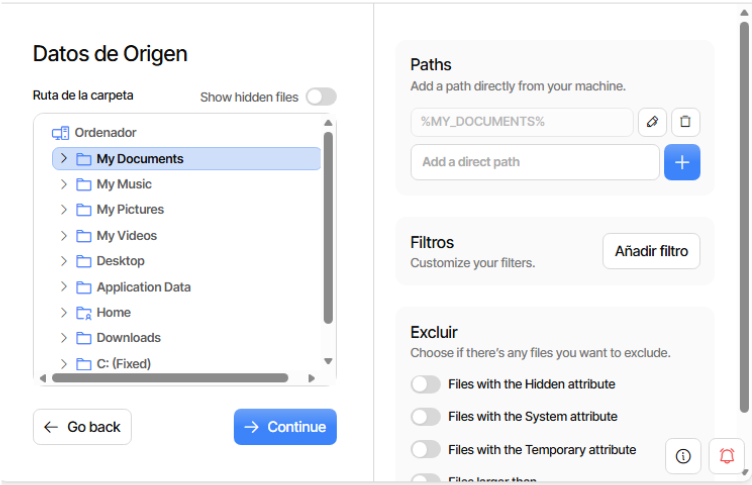

Podem comprovar que s'han creat els arxius entrant a la carpeta de backups i fent ls:

```
cd /media/backup
ls
```

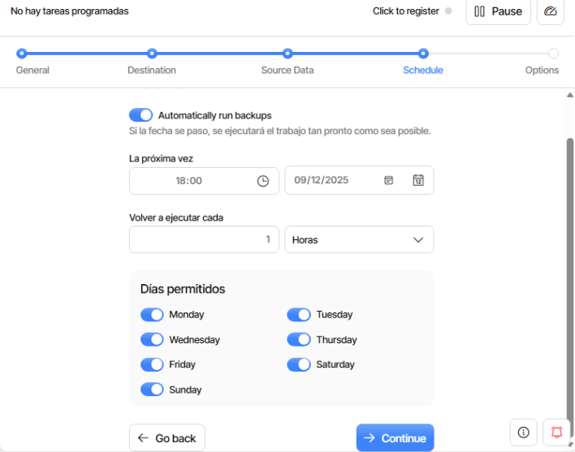

## Dades

Esborrem els arxius de prova:

```
sudo rm arxiu1
sudo rm arxiu2
sudo rm arxiu3
sudo rm arxiu4
```

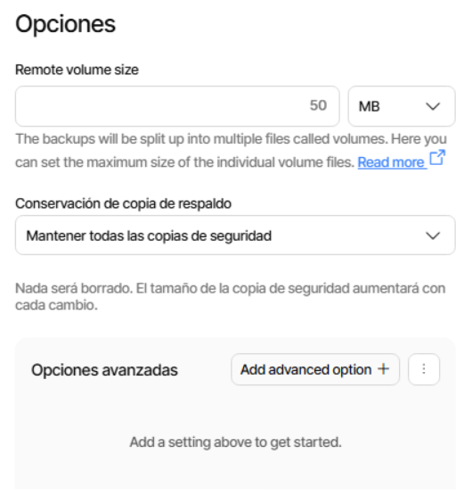

Després restaurem els arxius per provar si funciona:

```
sudo duplicity restore file:///media/backup/ /home/usuari
```

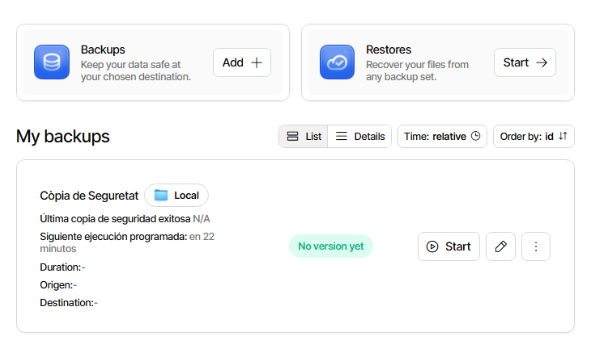

## Augmentar Backup

Afegirem un nou arxiu de 5MB per veure si la copia s'actualitza:

```
sudo fallocate -l 5MB arxiu5
```

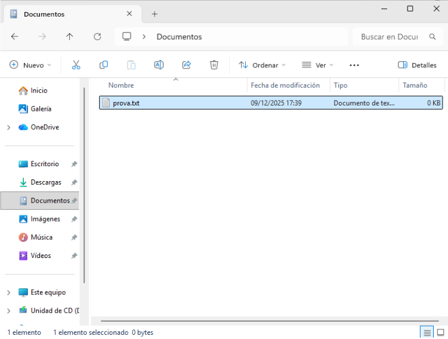

I fem una còpia nova perquè detecti el nou arxiu creat anteriorment:

```
sudo duplicity /home/ file:///media/backup/
```

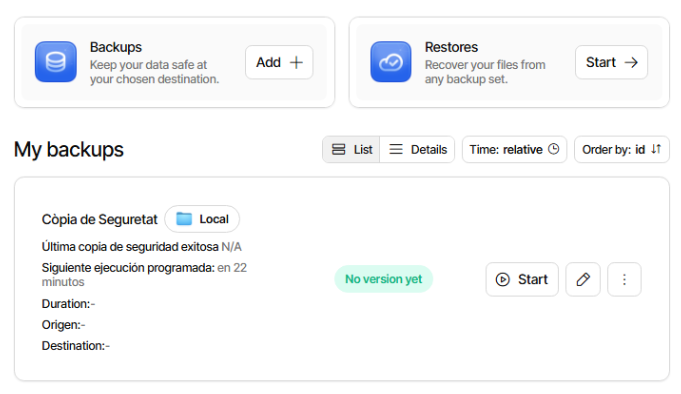

## Còpia automàtica

Desmuntem la còpia de /media/backup:

```
sudo umount /media/backup
```

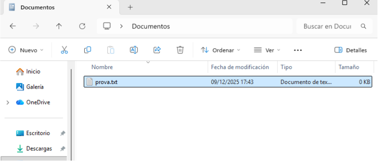

Creem el script fullbackup.sh i introduim el seguent:

```
!/bin/bash
export PASSPHRASE="usuariusuari1234"
mount /dev/sdb1 /media/backup
duplicity full /home file:///media/backup/homebackup
umount /media/backup
```

Donem permisos d'execució de l'arxiu:

```
sudo chmod +x fullbackup.sh
```

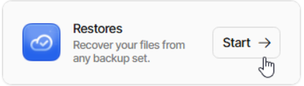

## CRON

Programarem el CRON perquè es faci a les 23:00:

```
sudo crontab -e
```

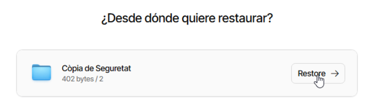

## Còpia automàtica incremental

Creem l'arxiu incrementalbackup.sh amb el seguent:

```
!/bin/bash
export PASSPHRASE="usuariusuari1234"
mount /dev/sdb1 /media/backup
duplicity incremental /home file:///media/backup/homebackup
umount /media/backup
```

Donem permisos d'execució amb:

```
sudo chmod +x incrementalbackup.sh
```

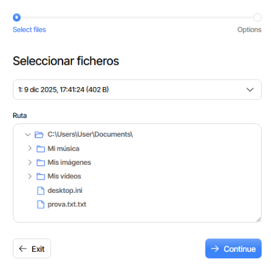

## Programació del CRON

Programarem la còpia automàtica perquè es faci de dilluns a dissabte a les 23:00:

```
sudo crontab -e
```

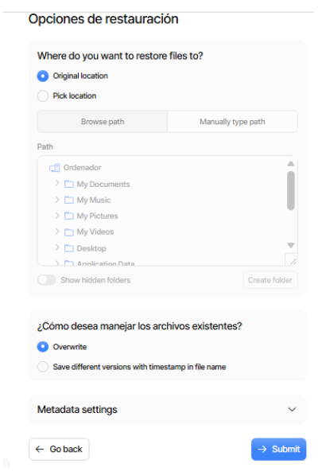
