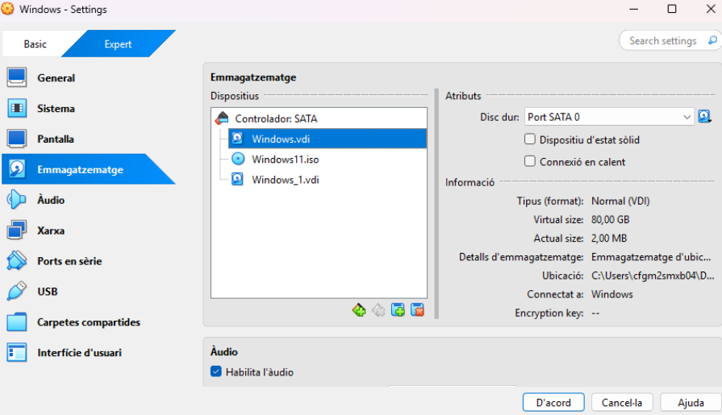
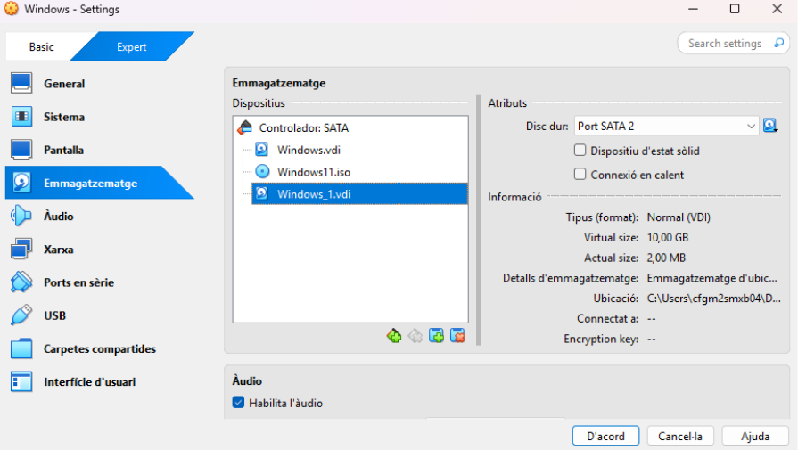
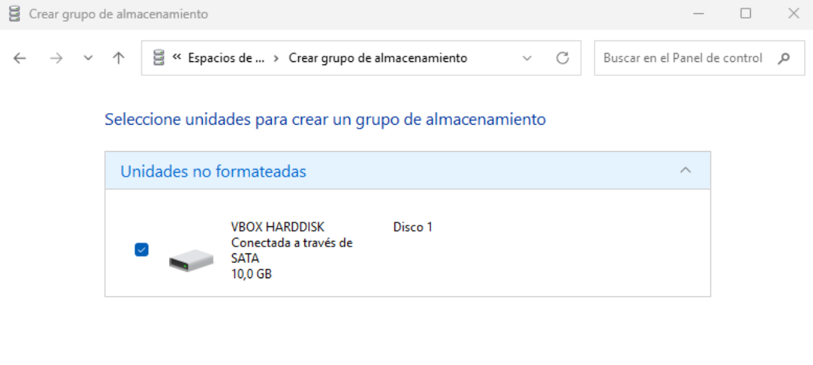
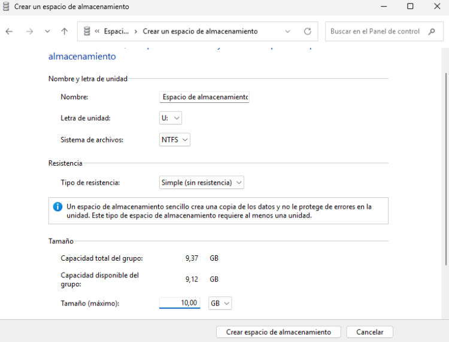
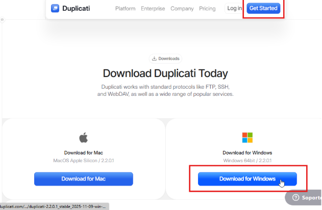
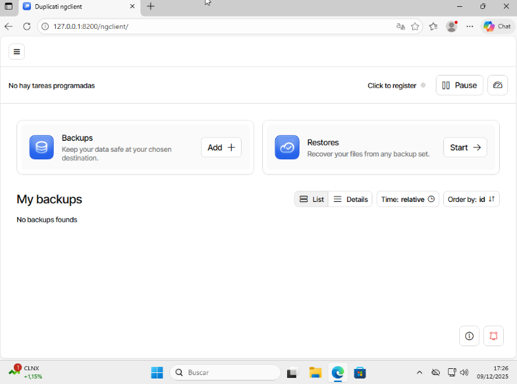
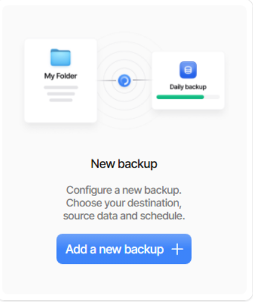
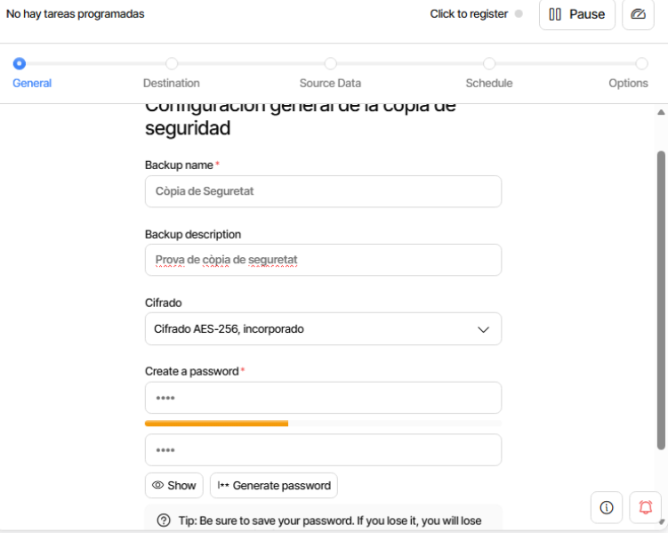
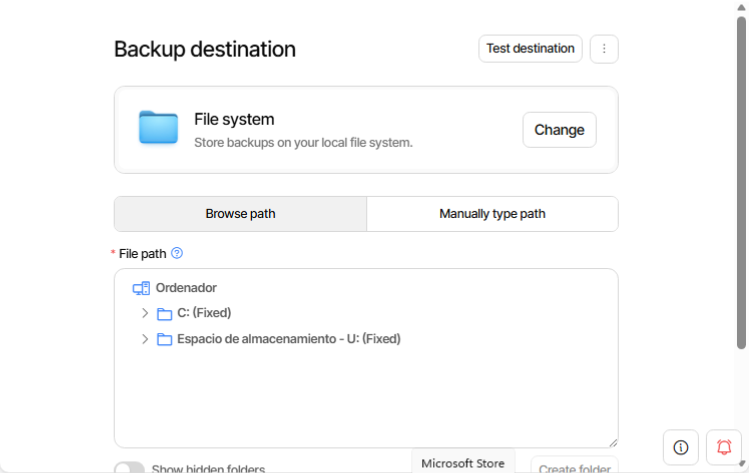

# T02: DPR: còpies de seguretat. Cas pràctic

## Instal·lació de la màquina virtual i els discs

Creem dos discos, en un instal·lem un sistema operatiu Windows i a l’altre que ha de ser de 10 GB posarem l’emmagatzematge de les còpies de seguretat.

En entrar, crearem un espai d’emmagatzematge al panell de control.

## Procés d’instal·lació de Duplicati

Cerquem “Duplicati” al buscador, i entrarem a la primera pàgina.

Pressionem “Get Started” i descarreguem l’aplicació per Windows.

Després iniciem l’instal·lador i procedim amb la instal·lació del programa.

Iniciem l’aplicació i pressionarem “Add” per anar a configurar el backup.

Seleccionem “New Backup” per crear-lo.

Posarem nom, descripció i contrasenya al nostre backup.

Elegim com a destinació del backup una carpeta i seleccionarem el disc que hem creat anteriorment.

Pressionem “test now”.

Escollim la carpeta que volem copiar.

Ho programem perquè realitzi el backup cada hora a diari.

Posem que mantingui totes les còpies de seguretat guardades.

I ja tenim el backup creat.

Creem un document a dins de la carpeta “documents” on hem fet el backup.ç

Un cop creat el document, pressionem “start” per començar la còpia. Quan ho fem, ens sortiràn dos backups.

Esborrem l’arxiu que hem creat anteriorment.

Per restaurar les còpies, anem a “restores” i pressionem “start”.

Anem a la còpia del disc secundari que es dirà com li hem possat anteriorment i pressionem “restore”.

Verificarem que l’arxiu que volem copiar apareix i continuarem.

A opcions de restauració, indicarem que es sobreescriuen el text.

