## T05: Accés Remot. Connexió via SSH (tasca individual)


A la màquina ubuntu, configurem una interfície en NAT i l’altre en Host-Only.

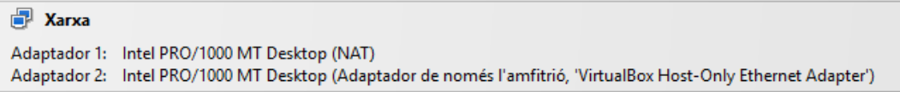

---
Modifiquem el netplan.

```
sudo nano /etc/netplan/50-cloud-init.yaml
```

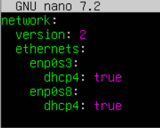

---
Instal·lem el servei ssh.

```
sudo apt install ssh
```

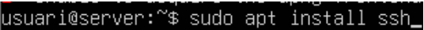

---
Ens connectem al servei ssh.

```
ssh usuari@192.168.56.101
```

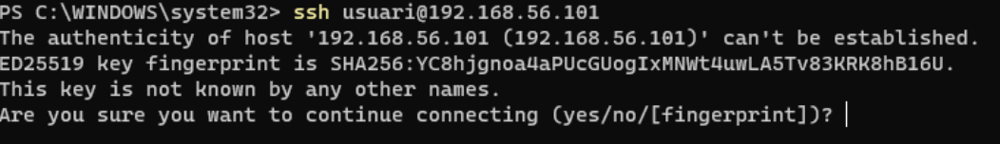

---
Comprovem que estem connectats al servidor des de la màquina client.

```
hostname
```

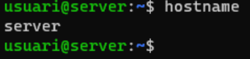

---
Li posem contrasenya a l’usuari root.

```
sudo passwd root
```

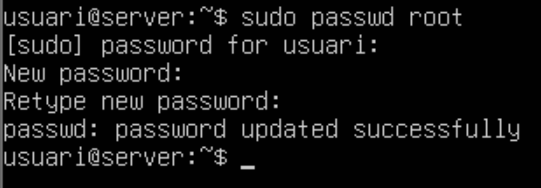

---
Entrem a l’arxiu /etc/ssh/sshd_config i afegim l’última línia.

```
sudo nano /etc/ssh/sshd_config
```

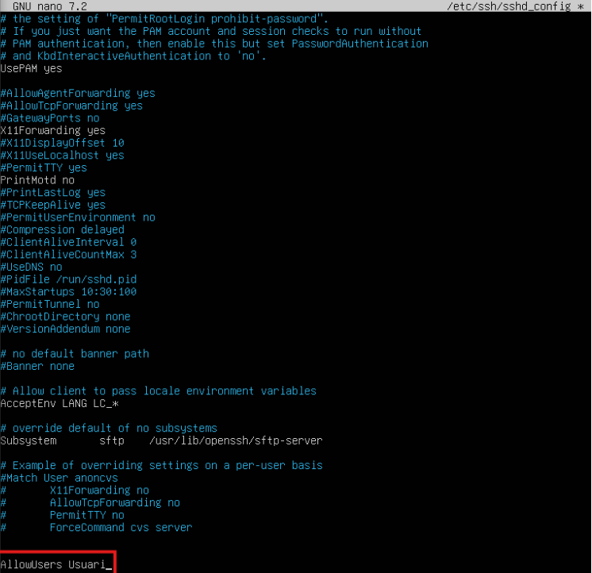

---
Entrem a l’usuari root amb “sudo - root” per comprovar que ens deixa i després sortim.

```
su - root
exit 
```

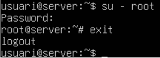

---
Intentem fer ssh des de la màquina client cap a l’usuari d’administrador del servidor i veurem com ens denega l’accés.

```
ssh root@192.168.56.101
```
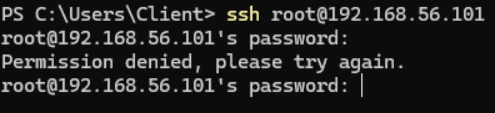

---
Des de la màquina client, introduïm la comanda “ssh-keygen -t rsa” perquè ens generi codis RSA.

```
ssh-keygen -t rsa
```

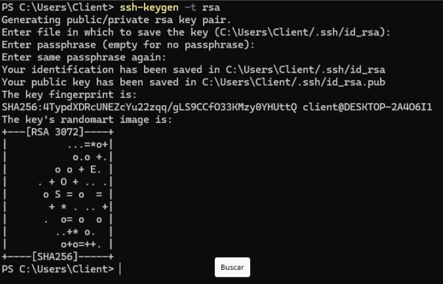

---
Amb la comanda “ls .\.ssh\” mirarem dins del directori de la carpeta ssh els arxius que hi ha creats, amb la data, el temps, mida i nom.

```
ls .\.ssh\
```
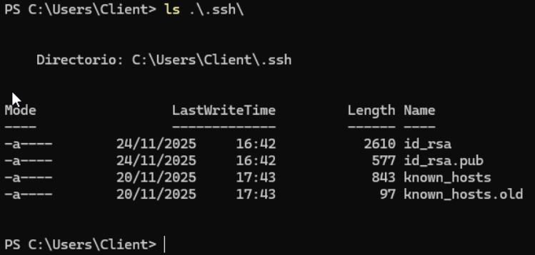

---
Dins de la carpeta ssh a la màquina del servidor, creem un arxiu.

```
touch .ssh/authorized_keys
```

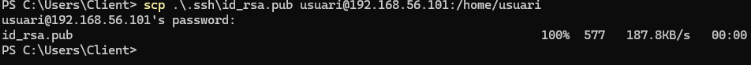

---
Copiem la clau que hem generat anteriorment a la carpeta ssh. 

```
cat id_rsa.pub >> .ssh/authorized_keys
```

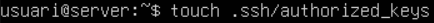

---
Des de la màquina client, comprovem que podem fer ssh sense necessitat de la contrasenya.

```
ssh usuari@192.168.56.101
```

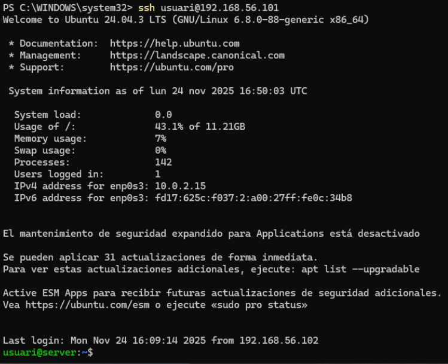

---
Per tenir el servidor OpenSSH hem d’anar a configuració, característiques opcionals i activar el client OpenSSH.

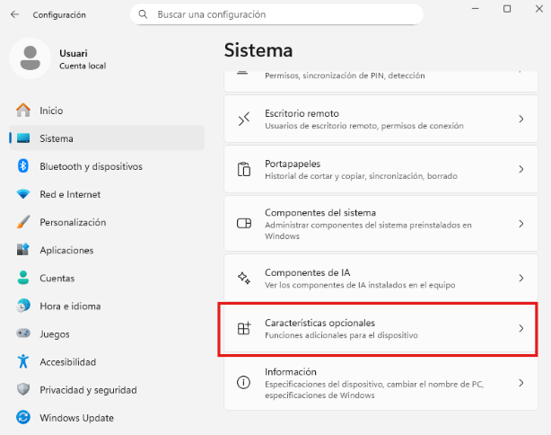
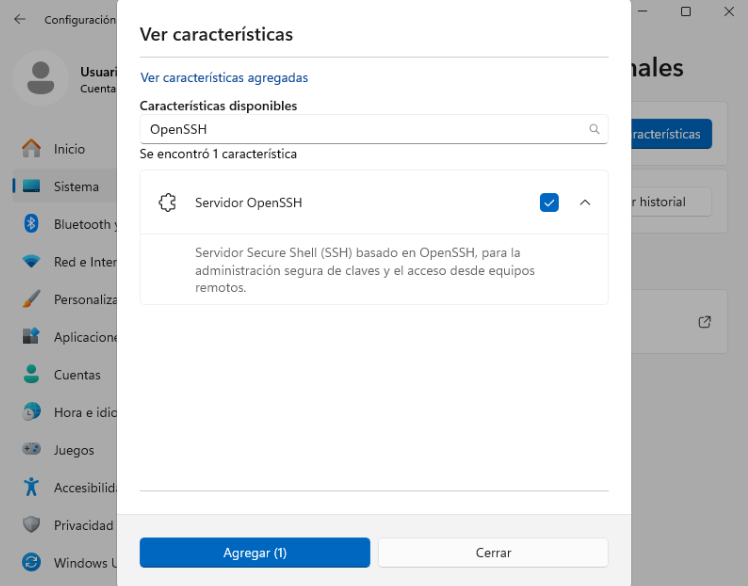

---


