# T06: Accés remot. Escriptori remot (RDP)  

## Configuració de la màquina Windows

Perquè les màquines es comuniquin, posarem interfície **host-only** a les dues màquines.

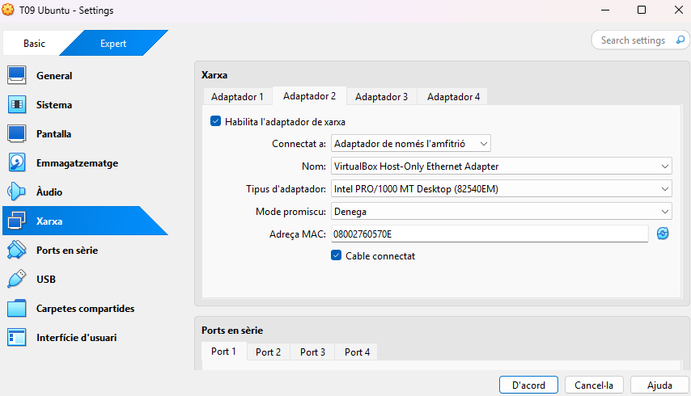

Un cop a la màquina virtual, ens dirigim a la configuració de l’escriptori remot.

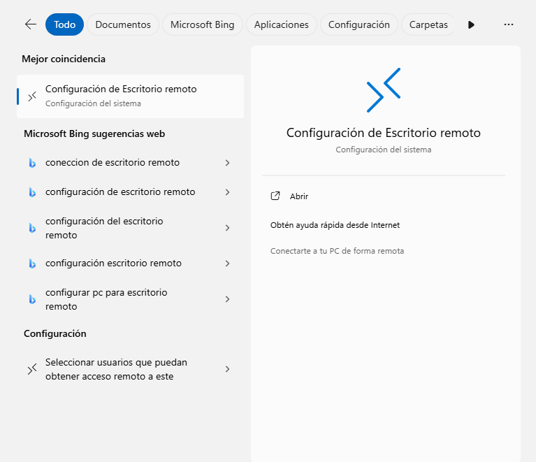

Activem l’escriptori remot.

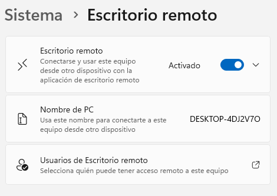

Un cop activada aquesta opció, ja ens podríem connectar a la màquina Zorin.

---

## Configuració de la màquina Zorin

Ara, fem el mateix. Anem a la màquina Zorin a activar l’accés remot.
Anirem a **Configuració** i baixarem fins l’apartat **System**, després entrarem a **Remote Desktop**.

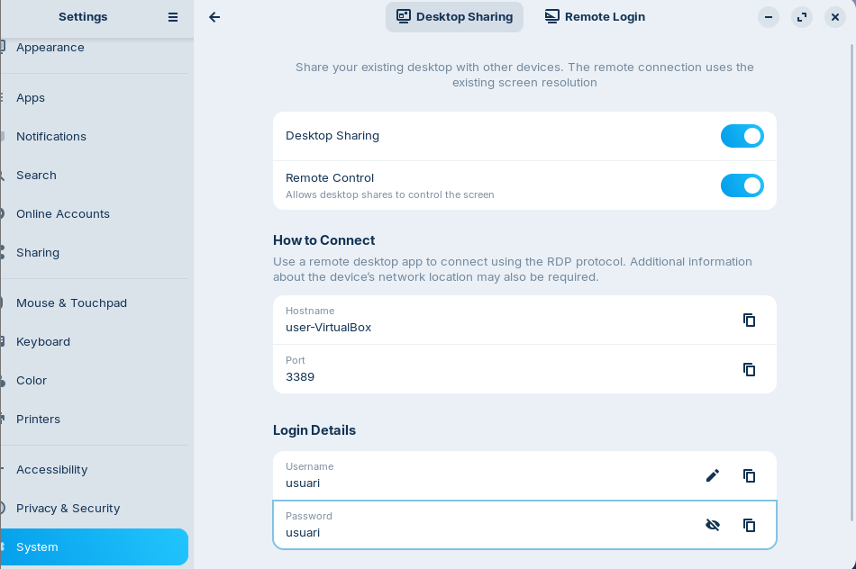

Habilitarem **Desktop Sharing** i **Remote Control** per permetre que l’altre usuari es connecti a la nostra màquina.  
Podem canviar també el nom d’usuari i la contrasenya per iniciar sessió.


---

## Connexió remota de màquina Windows a Zorin

Buscarem al buscador **“conexión a escritorio remoto”** i entrarem.  
Un cop a dins, haurem d’introduir l’IP de la màquina client a la que ens vulguem connectar.  
Cal destacar que es pot veure des de la terminal amb la comanda:

```bash
ip a
```

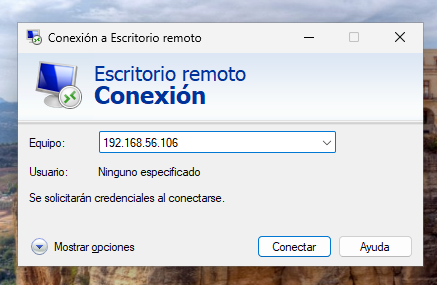

Al connectar-nos, ens demanarà credencials.

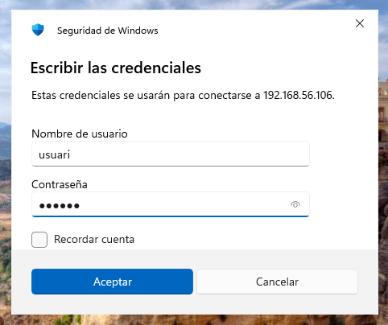

Ens apareixerà una finestra de certificació, apretem sí.

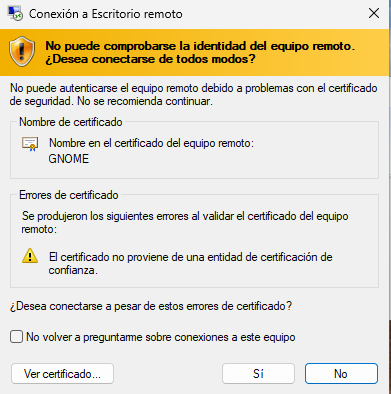

I ja estarem connectats.

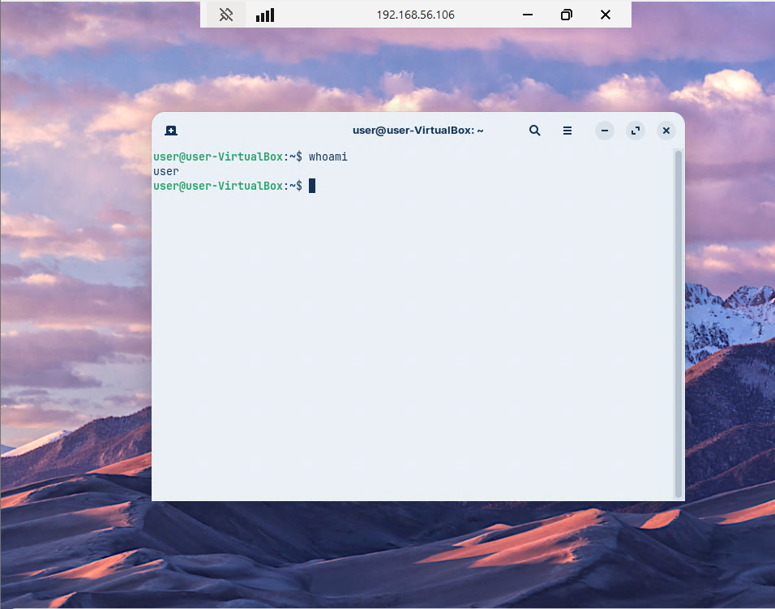

---

## Connexió remota de màquina Zorin a Windows

Per connectar-nos, utilitzarem l’aplicació **Remmina**, que ve predeterminada al instal·lar Zorin.

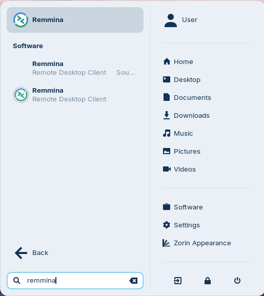

A dins, introduirem l’IP de la màquina Windows.  
Podem consultar-la des de la terminal amb la comanda:

```bash
ipconfig
```

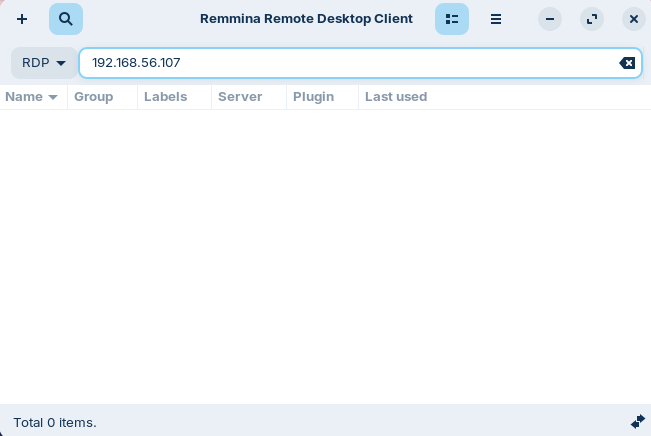

Ens sortirà un certificat per acceptar la connexió remota, pressionem “yes”.

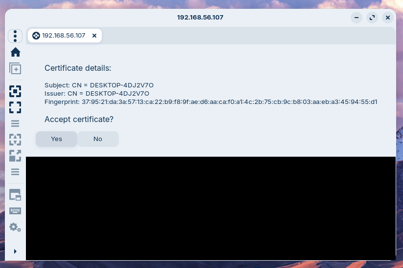

Ens demanarà les credencials. Les introduïm i pressionem “OK”.

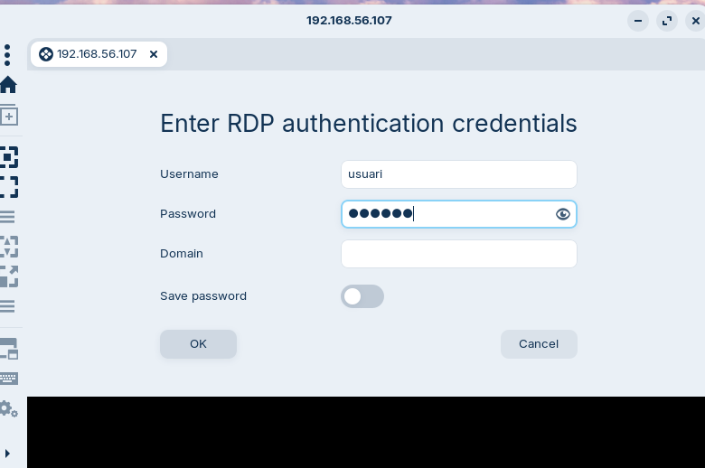

I ja ens hauriem connectat.

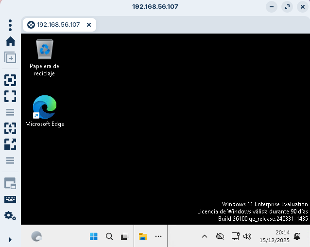
