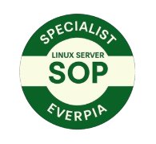

# 🧾 T08: Auditoria de Qualitat i Estandardització de Servidors (Tasca Individual)

## 📝 Breu descripció

## 🧭 Introducció

Benvinguts, equip 👋.

Durant les darreres setmanes hem implementat serveis complexos per als nostres clients, com:
- Servidors de fitxers **NFS** 📁  
- Sistemes d’impressió **CUPS** 🖨️  
- Sistemes d’autenticació **LDAP** 🔑  
…i molts altres.

Però **cap servei avançat pot funcionar de manera fiable si els fonaments del sistema operatiu són febles** ⚠️.

Un servidor amb:
- Configuració de xarxa incorrecta 🌐  
- Permisos mal assignats 🔒  
- Paquets sense actualitzar ⏳  

…és un risc de seguretat i una incidència garantida.  
A **EverPia**, no podem lliurar res així: la nostra reputació es basa en la **robustesa i la qualitat**.

---

# 🎯 La Vostra Missió: Auditoria i Estandardització del Servidor Base

Abans de desplegar un nou servei avançat, farem un pas enrere per consolidar la base.  
Aquesta activitat és una **auditoria interna** i forma part del nostre:

> **Protocol de Desplegament Estàndard (SOP — Standard Operating Procedure)**

Heu de demostrar que sou capaços de:
- Desplegar una **nova màquina virtual Ubuntu Server** 🐧  
- Configurar-la **des de zero**  
- Aplicar el nostre **protocol de configuració bàsica**

Aquestes tasques són fonamentals i tot consultor júnior les ha de dominar **abans de tocar l’entorn d’un client**.  
Aquesta fase serveix per garantir que **tots estem al mateix nivell d'excel·lència** ⭐.

Prepareu-vos: un cop finalitzada la fase d’entrenament, haureu de superar una **prova pràctica de validació** per obtenir la certificació:

> 🥇 **SOP-Specialist**

---

# 🏋️ Fase d’entrenament

Per practicar els vostres coneixements, i utilitzant la **OVA disponibilitzada**, heu de completar les tasques del document:

📄 **Projecte4-TascaSOP**  
(*el podeu descarregar directament*)

No cal lliurar cap activitat, però **és essencial** que presteu molta atenció per entendre bé tots els procediments.

---

# 🧪 Certificació

Ha arribat el dia!  
Ja esteu preparats per assolir el nivell **SOP Specialist**, superant un **examen pràctic exigent** que posarà a prova els vostres coneixements.

📌 **Per la prova només podeu portar un full manuscrit** ✍️  
Amb les anotacions que considereu necessàries.

---

