# T09: Servidor fitxers Linux. NFS (tasca individual)

## Fase 1: Preparació de l'entorn
Preparem dues màquines, un servidor i un client. Instal·larem ubuntu i zorin respectivament i a les dues posarem dues interfícies:

- **NAT** (per tindre connexió).
- **Host-Only** (per poder comunicar les màquines)

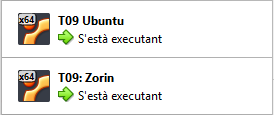

Un cop fets els passos anteriors, farem un ping per comprovar que es veuen entre si

```bash
ping 192.168.56.105
```


Per si de cas, instal·lem el servei ssh a la màquina servidor i client amb “sudo apt install ssh”.

```bash
sudo apt install ssh
```

Finalment, actualitzem les màquines.


---

## Fase 2: Preparació del servidor

**Per la creació dels usuaris i grups, ho haurem de fer en les dues màquines.**

### Màquina Zorin:

Instal·larem en Zorin una aplicació per crear-ho bé.

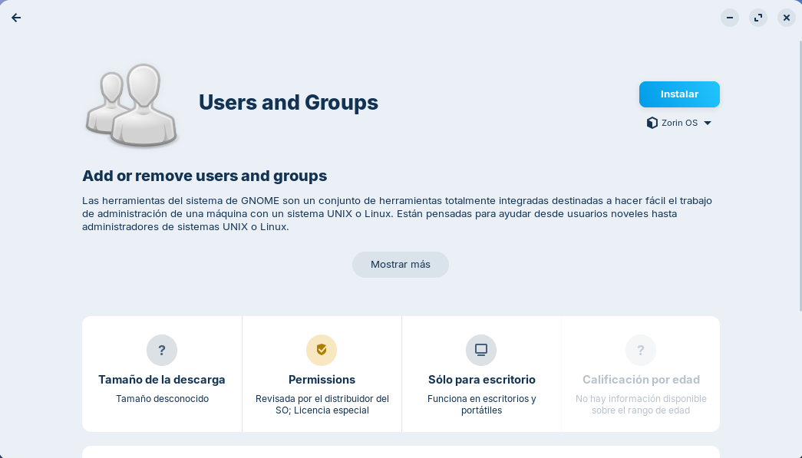

Afegirem els dos usuaris.

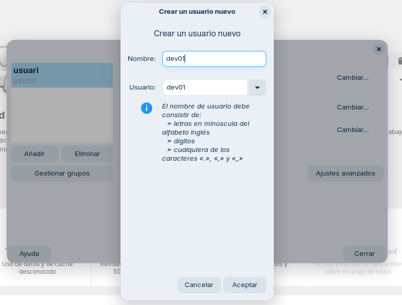

I finalment afegim els usuaris al grups corresponents.

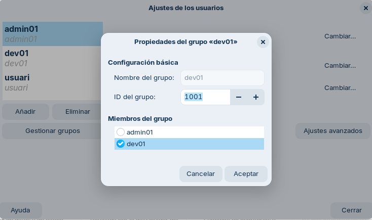

### Màquina Ubuntu:

Creem els dos grups: devs i admins.

```bash
sudo groupadd devs/admins
```

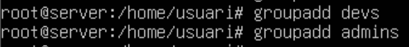

Creem els usuaris amb directori personal: dev01 i admin01.

```bash
sudo useradd -m dev01
sudo useradd -m admin01
```

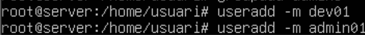

Afegim els usuaris als grups corresponents.

```bash
usermod -aG devs dev01
usermod -aG admins admin01
```

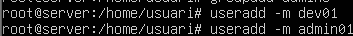

Per comprovar-ho podem fer la següent comanda:

```bash
getent group dev01 | tail
getent group admin01 | tail
```

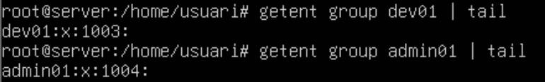

Creem el directori per al desenvolupament.

```bash
cd /srv
mkdir /nfs/dev_projectes
```

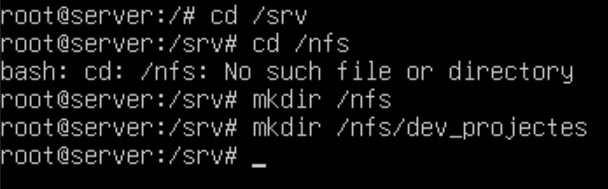

Creem el directori per l’administració.

```bash
mkdir /nfs/admin_tools
```

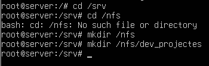

Podem comprovar la creació amb ls

```bash
ls
```


Donem permís d’administrador als dos usuaris sobre els seus projectes. Cal destacar que l’usuari propietari ha de ser root.

```bash
chown root:devs dev_projectes
chown root:admins admin_tools
```
```bash
chmod 770 dev_projectes
chmod 770 admin_tools
```

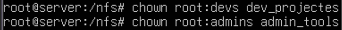


Instal·lem el servei nfs.

```bash
apt install nfs-kernel-server
```


Podem comprovar que està actiu.

```bash
systemctl status nfs-server
```

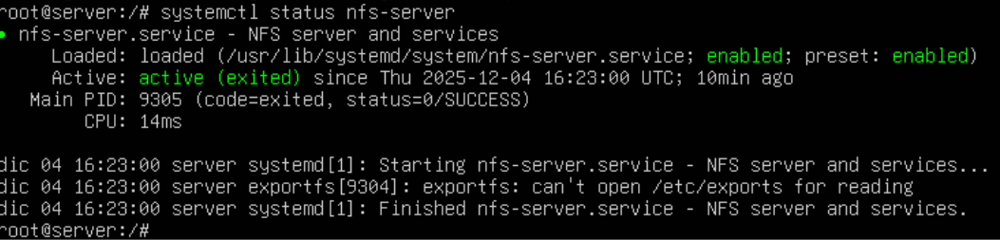

---

## Fase 3: L'Exportació d'Administració (El Dilema del root_squash)

Creem el directori srv/nfs/admin_tools i li donem permisos a root.

```bash
sudo mkdir -p /srv/nfs/admin_tools
sudo chown root:root /srv/nfs/admin_tools
sudo chmod 755 /srv/nfs/admin_tools
```

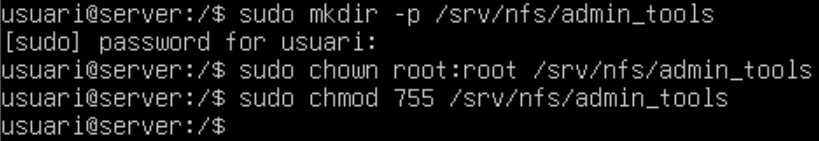

### Prova 1

```bash
sudo nano /etc/exports
```

Configurem l’arxiu /etc/exports perquè l’exportació es faci del arxiu /srv/nfs/admin_tools, posem la ip de la màquina client i habilitem la opció de root_squash.

Anyadirem la línea d'abaix seguint la seguent estructura:

```bash
/ruta/de/carpeta IP-CLIENT(rw,sync,root_squash)
```


Exportem la configuració i la comprovem.

```bash
sudo exportfs -v
```

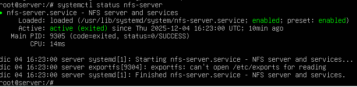

Instal·lem nfs a la màquina client.

```bash
sudo apt update && sudo apt install nfs-common -y
```


Creem el punt de muntatge i muntem.

```bash
sudo mkdir -p /mnt/admin_tools
sudo mount 192.168.56.105:/srv/nfs/admin_tools /mnt/admin_tools
```


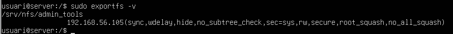


Creem un arxiu com a usuari root.

```bash
sudo touch /mnt/admin_tools/testfile
```


## Problema de root_squash

Quan intentem accedir a la carpeta `/mnt/admin_tools` no ens deixarà.  
Això succeeix perquè en el **NFS** està habilitat el `root_squash`.  
Això fa que el **root** a la màquina client sigui “nobody” i que no tingui permisos dins de cap grup o usuari.

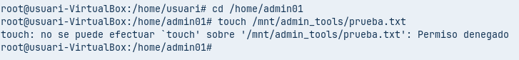

Si provem de crear un arxiu a la carpeta de **admin01** des de **root**, no ens deixarà.


Ara, si fem l’arxiu havent entrat a l’usuari **admin01**, podem comprovar que sí que ens deixa.

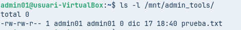

---

## Solució de root_squash

A recursos compartits, canviarem la línia de codi que hem introduït anteriorment per especificar que **no volem `root_squash`**.

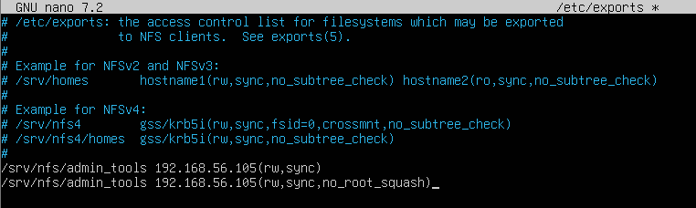

Un cop fet això, reiniciarem el servei **NFS**.

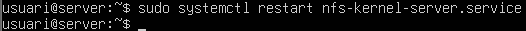

Desmuntarem el recurs compartit i el tornarem a muntar.


Ara ja ens deixarà crear un arxiu com a **root**, perquè hem especificat que no s’apliqui el `root_squash`.


---

## Fase 4: L'Exportació de Desenvolupament

Editem l’arxiu `/etc/exports` per indicar l’exportació del directori **dev_projectes**.

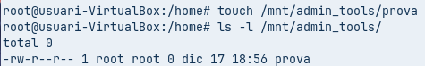

Reiniciem el servei **NFS**.

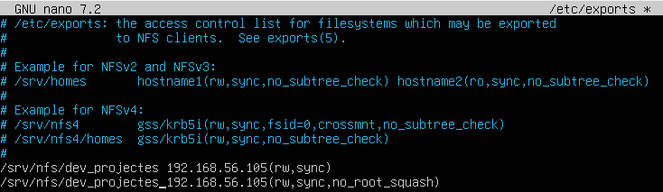

Exportem l’arxiu.


Muntem l’arxiu a la màquina client.

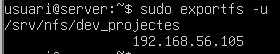

Entrem a l’usuari **dev01** i creem un arxiu amb `touch`.


Desmuntem el recurs compartit.

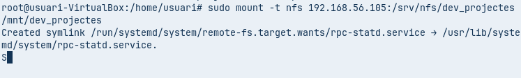

Editem la IP des de la configuració a `192.168.56.140` i podem comprovar que amb aquesta IP **no podem editar arxius**, però sí veure’ls.


Iniciem sessió amb l’usuari **admin01** i veiem que ens denega el permís de creació.


---

## Fase 5: Muntatge Automàtic amb `/etc/fstab`

Ara configurarem l’arxiu `/etc/fstab` perquè no haguem de muntar el recurs compartit cada vegada que haguem d’entrar.

Afegirem aquestes dues línies:

```fstab
192.168.56.105:/srv/nfs/admin_tools /mnt/admin_tools nfs defaults 0 0
192.168.56.105:/srv/nfs/dev_projects  /mnt/dev_projects  nfs defaults 0 0
```

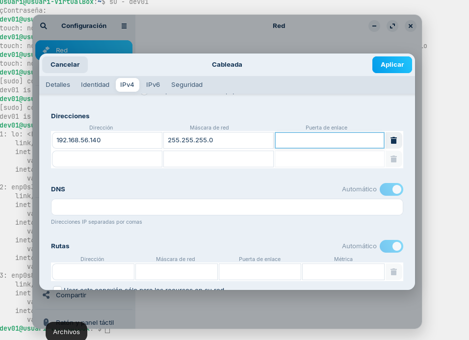

Fem reboot i podem confirmar si està correcte:

```
ls -l /mnt/
```

## Conclusió

Això que hem fet no es òptim si ho hem de fer per a molts ordinadors, ja que hauriem de repetir el procés a tots si sería una pèrdua de temps. Una solució adequada seria la d’usar algún servei que fagi la mateixa configuració per a tots el ordinadors a la vegada per optimitzar el temps.
