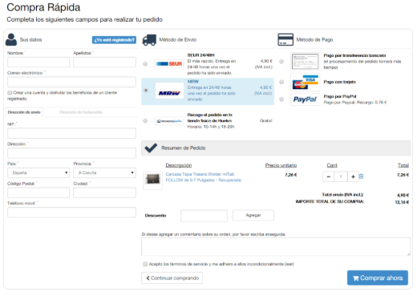

# 🌐 T12: Fonaments del Disseny Web Comercial — Landing Page + Procés de Checkout

## 📝 Breu descripció

Classe magistral per entendre **l’estructura de les pàgines web**, centrant-nos en:

- **Landing Page**  
- **Procés de Checkout** 🛒

Abans de dissenyar la maqueta completa de l’e-commerce del client d’EverPia, és fonamental comprendre **els dos pilars essencials de qualsevol botiga online**:

1. **Landing Page**: la primera impressió i el punt de contacte inicial amb l’usuari.  
2. **Procés de Checkout**: el flux que condueix l’usuari fins a completar la compra.

Aquesta tasca ofereix una **visió completa del recorregut de l’usuari**, des que arriba a la web fins que finalitza la transacció.

---

## 🔗 Enllaços d’interès

### Exemple de Landing Page extensa
https://romualdfons.com/monetizacion-webs/  

### Exemple de pantalles de Checkout

---

